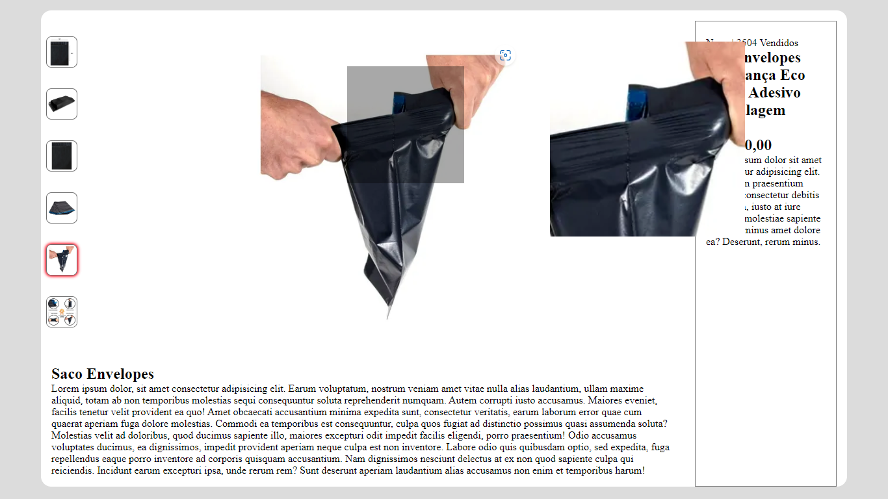

## Gallery with zoom

Gallery with zoom using JavaScript, HTML and CSS only. No framework or libraries. This gallery is for desktop only.

This kind of gallery is very similar nowdays. Give the user the abilaty to change and zoon the image without a single click. Just have to hover in the thumbnail to change the main image. Also can see a zoom of the image by hovering over the image.

# Languages used
* HTML
* CSS
* JavaScript

# Explanation

The code is well divided, to make it easy to update and also to other people to understand. It has 5 functions. All with objective names.

The functions are:
* __handleChangeImageThumbnail__: This function have the job to change the main image when hover over each thumbnails. Also change the style of the active thumbnail.

* __getMousePositionForLens__: Here is where we calculate the x and y position of the cursor on the image. In addition, it set boundries to avoid the rectangular lens move out of the image.

* __handleZoomLensPosition__:  This function is responsible to set the position of both Lens and zoom container.
To move the Lens, the function __getMousePositionForLens__ is used to get the x, y values and set the left and top values of the Lens. 
To calculate the background Position and size of the zoom container, the fraction between the zoom container and the rectangular Lens is calculated. After this, the values are set.

* __handleZoomLensActivation__: As the name suggest, here is where we acitivate the zoom and the Lens when the mouse in inside the image. Also where the background Image of the zoom_container is set.

* __handleZoomLensDeactivation__: Deactivate the zoom and lens when cursor is out of the image.

The Event listeners:

There are event to the windom, the thumbnails and to the figure_image (the main image). 
* The event on the windom is the load event. To set the main image and the thumbnail style when load.
* All thumbnails have an event to change the image and thumbnail style
* The figure_image have 3 events. To show and hide rec_lens and zoom_container. Also to trigger the zoom logic.

# How can I use it?

First, you can clone the project at your folder. Use the commande line on you folder:
 > git clone https://github.com/Vinicius-PR/Gallery-with-zoom.git
 
Then you will have all the code. Just open the index.html at your browser to see the result.
 
# ScreenShot

 